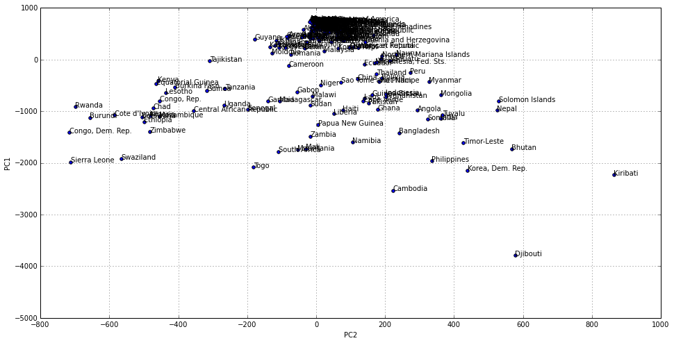
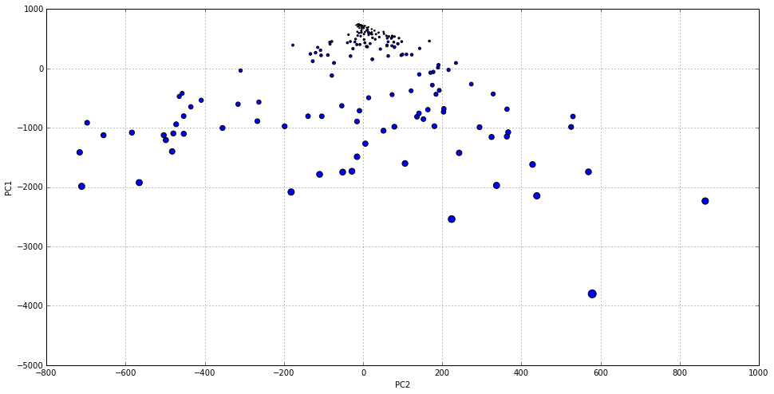
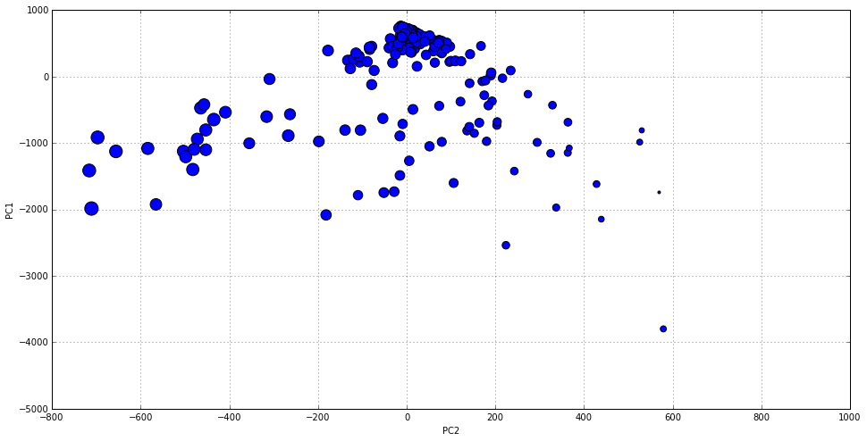

# Dimensionality Reduction and Clustering for Exploratory Data Analysis

An important step in data analysis is data exploration and representation. We
have already seen some concepts in Exploratory Data Analysis and how to use them
in Python. In this tutorial we will see how by combining a technique called
[Principal Component Analysis
(PCA)](https://en.wikipedia.org/wiki/Principal_component_analysis) together with
[Cluster Analysis](https://en.wikipedia.org/wiki/Cluster_analysis) we can
**represent in a two dimensional space data defined in a higher dimensional
one** while, at the same time, being able to group this data in similar groups
or clusters and **find hidden relationships in our data**.

More concretely, PCA reduces data dimensionality by finding **principal
components**. These are the directions of maximum variation in a dataset. By
reducing a dataset original features or variables to a reduced set of new ones
based on the principal components, we end up with the minimum number of
variables that keep the **maximum amount of variation or information about how
the data is distributed**. If we end up with just two of these new variables, we
will be able to represent each sample in our data in a two dimensional chart
(e.g. a scatterplot).

As an unsupervised data analysis technique, clustering organises data samples by
proximity based on its variables. By doing so we will be able to understand how
each data point relates to each other and discover groups of similar ones. Once
we have each of this groups or clusters, we will be able to define a centroid
for them, an ideal data sample that minimises the sum of the distances to each
of the data points in a cluster. By analysing these centroids variables we will
be able to define each cluster in terms of its characteristics.

But enough theory for today. Let's put these ideas in practice by using Python
and R so we better understand them in order to apply them in the future.

## Getting and preparing data

The [Gapminder website](http://www.gapminder.org/) presents itself as *a fact-
based worldview*. It is a comprehensive resource for data regarding different
countries and territories indicators. Its [Data
section](http://www.gapminder.org/data/) contains a list of datasets that can be
accessed as Google Spreadsheet pages (add `&output=csv` to download as CSV).
Each indicator dataset is tagged with a *Data provider*, a *Category*, and a
*Subcategory*.

For this tutorial, we will use a dataset related to prevalence of Infectious
Tuberculosis:

- [TB estimated prevalence (existing cases) per 100K](https://docs.google.com/sp
readsheets/d/1X5Jp7Q8pTs3KLJ5JBWKhncVACGsg5v4xu6badNs4C7I/pub?gid=0)

We invite the reader to repeat the process with the new cases and deaths
datasets and share the results.

This notebook is about exploring the countries distribution. Therefore we will
work with datasets where each sample is a country and each variable is a year.

So first, we need to download Google Spreadsheet data as CSV.

    import urllib
    
    tb_existing_url_csv = 'https://docs.google.com/spreadsheets/d/1X5Jp7Q8pTs3KLJ5JBWKhncVACGsg5v4xu6badNs4C7I/pub?gid=0&output=csv'
    local_tb_existing_file = 'tb_existing_100.csv'
    existing_f = urllib.urlretrieve(tb_existing_url_csv, local_tb_existing_file)

Now that we have it locally, we need to read the CSV file as a data frame.

    import pandas as pd
    
    existing_df = pd.read_csv(local_tb_existing_file, index_col = 0, thousands  = ',')
    existing_df.index.names = ['country']
    existing_df.columns.names = ['year']

We have specified `index_col` to be 0 since we want the country names to be the
row labels. We also specified the `thousands` separator to be ',' so Pandas
automatically parses cells as numbers. We can use `head()` to check the first
few lines.

    existing_df.head()

<table border="1" class="dataframe">
  <thead>
    <tr style="text-align: right;">
      <th>year</th>
      <th>1990</th>
      <th>1991</th>
      <th>1992</th>
      <th>1993</th>
      <th>1994</th>
      <th>1995</th>
      <th>1996</th>
      <th>1997</th>
      <th>1998</th>
      <th>1999</th>
      <th>2000</th>
      <th>2001</th>
      <th>2002</th>
      <th>2003</th>
      <th>2004</th>
      <th>2005</th>
      <th>2006</th>
      <th>2007</th>
    </tr>
    <tr>
      <th>country</th>
      <th></th>
      <th></th>
      <th></th>
      <th></th>
      <th></th>
      <th></th>
      <th></th>
      <th></th>
      <th></th>
      <th></th>
      <th></th>
      <th></th>
      <th></th>
      <th></th>
      <th></th>
      <th></th>
      <th></th>
      <th></th>
    </tr>
  </thead>
  <tbody>
    <tr>
      <th>Afghanistan</th>
      <td> 436</td>
      <td> 429</td>
      <td> 422</td>
      <td> 415</td>
      <td> 407</td>
      <td> 397</td>
      <td> 397</td>
      <td> 387</td>
      <td> 374</td>
      <td> 373</td>
      <td> 346</td>
      <td> 326</td>
      <td> 304</td>
      <td> 308</td>
      <td> 283</td>
      <td> 267</td>
      <td> 251</td>
      <td> 238</td>
    </tr>
    <tr>
      <th>Albania</th>
      <td>  42</td>
      <td>  40</td>
      <td>  41</td>
      <td>  42</td>
      <td>  42</td>
      <td>  43</td>
      <td>  42</td>
      <td>  44</td>
      <td>  43</td>
      <td>  42</td>
      <td>  40</td>
      <td>  34</td>
      <td>  32</td>
      <td>  32</td>
      <td>  29</td>
      <td>  29</td>
      <td>  26</td>
      <td>  22</td>
    </tr>
    <tr>
      <th>Algeria</th>
      <td>  45</td>
      <td>  44</td>
      <td>  44</td>
      <td>  43</td>
      <td>  43</td>
      <td>  42</td>
      <td>  43</td>
      <td>  44</td>
      <td>  45</td>
      <td>  46</td>
      <td>  48</td>
      <td>  49</td>
      <td>  50</td>
      <td>  51</td>
      <td>  52</td>
      <td>  53</td>
      <td>  55</td>
      <td>  56</td>
    </tr>
    <tr>
      <th>American Samoa</th>
      <td>  42</td>
      <td>  14</td>
      <td>   4</td>
      <td>  18</td>
      <td>  17</td>
      <td>  22</td>
      <td>   0</td>
      <td>  25</td>
      <td>  12</td>
      <td>   8</td>
      <td>   8</td>
      <td>   6</td>
      <td>   5</td>
      <td>   6</td>
      <td>   9</td>
      <td>  11</td>
      <td>   9</td>
      <td>   5</td>
    </tr>
    <tr>
      <th>Andorra</th>
      <td>  39</td>
      <td>  37</td>
      <td>  35</td>
      <td>  33</td>
      <td>  32</td>
      <td>  30</td>
      <td>  28</td>
      <td>  23</td>
      <td>  24</td>
      <td>  22</td>
      <td>  20</td>
      <td>  20</td>
      <td>  21</td>
      <td>  18</td>
      <td>  19</td>
      <td>  18</td>
      <td>  17</td>
      <td>  19</td>
    </tr>
  </tbody>
</table>

## Dimensionality reduction with PCA

In this section we want to be able to represent each country in a two
dimensional space. In our dataset, each sample is a country defined by 18
different variables, each one corresponding to TB cases counts per 100K
(existing, new, deaths) for a given year from 1990 to 2007.  These variables
represent not just the total counts or average in the 1990-2007 range but also
all the variation in the time series and relationships within countries in a
given year. By using PCA we will be able to reduce these 18 variables to just
the two of them that best captures that information.

In order to do so, we will first how to perform PCA and plot the first two PCs
in both, Python and R. We will close the section by analysing the resulting plot
and each of the two PCs.

Python's sklearn machine learning library comes with a [PCA implementation](http
://scikit-learn.org/stable/modules/generated/sklearn.decomposition.PCA.html).
This implementation uses the `scipy.linalg` implementation of the [singular
value
decomposition](https://en.wikipedia.org/wiki/Singular_value_decomposition). It
only works for dense arrays (see [numPy dense
arrays](http://docs.scipy.org/doc/numpy/reference/generated/numpy.array.html) or
[sparse array PCA](http://scikit-learn.org/stable/modules/generated/sklearn.deco
mposition.SparsePCA.html#sklearn.decomposition.SparsePCA) if you are using
sparse arrays) and is not scalable to large dimensional data. For large
dimensional data we should consider something such as [Spark's dimensionality
reduction features](http://spark.apache.org/docs/latest/mllib-dimensionality-
reduction.html). In our case we just have 18 variables, and that is far from
being a large number of features for any machine learning library and computer
nowadays.

When using this implementation of PCA we need to specify in advance the number
of principal components we want to use. Then we can just call the `fit()` method
with our data frame and check the results.

    from sklearn.decomposition import PCA
    
    pca = PCA(n_components=2)
    pca.fit(existing_df)

    PCA(copy=True, n_components=2, whiten=False)

This gives us an object we can use to transform our data by calling `transform`.

    existing_2d = pca.transform(existing_df)

Or we could have just called `fit_transform` to perform both steps in one single
call.

In both cases we will end up with a lower dimension representation of our data
frame, as a numPy array. Let's put it in a new dataframe.

    existing_df_2d = pd.DataFrame(existing_2d)
    existing_df_2d.index = existing_df.index
    existing_df_2d.columns = ['PC1','PC2']
    existing_df_2d.head()

<table border="1" class="dataframe">
  <thead>
    <tr style="text-align: right;">
      <th></th>
      <th>PC1</th>
      <th>PC2</th>
    </tr>
    <tr>
      <th>country</th>
      <th></th>
      <th></th>
    </tr>
  </thead>
  <tbody>
    <tr>
      <th>Afghanistan</th>
      <td>-732.215864</td>
      <td> 203.381494</td>
    </tr>
    <tr>
      <th>Albania</th>
      <td> 613.296510</td>
      <td>   4.715978</td>
    </tr>
    <tr>
      <th>Algeria</th>
      <td> 569.303713</td>
      <td> -36.837051</td>
    </tr>
    <tr>
      <th>American Samoa</th>
      <td> 717.082766</td>
      <td>   5.464696</td>
    </tr>
    <tr>
      <th>Andorra</th>
      <td> 661.802241</td>
      <td>  11.037736</td>
    </tr>
  </tbody>
</table>

We can also print the explained variance ratio as follows.

    print(pca.explained_variance_ratio_) 

    [ 0.91808789  0.060556  ]

We see that the first PC already explains almost 92% of the variance, while the
second one accounts for another 6% for a total of almost 98% between the two of
them.

Now we are ready to plot the lower dimensionality version of our dataset. We
just need to call plot on the data frame, by passing the kind of plot we want
(see [here](http://pandas.pydata.org/pandas-
docs/version/0.15.0/visualization.html) for more on plotting data frames) and
what columns correspond to each axis. We also add an annotation loop that tags
every point with its country name.

    %matplotlib inline
    
    ax = existing_df_2d.plot(kind='scatter', x='PC2', y='PC1', figsize=(16,8))
    
    for i, country in enumerate(existing_df.index):
        ax.annotate(country, (existing_df_2d.iloc[i].PC2, existing_df_2d.iloc[i].PC1))

Let's now create a bubble chart, by setting the point size to a value
proportional to the mean value for all the years in that particular country.
First we need to add a new column containing the re-scaled mean per country
across all the years.

    from sklearn.preprocessing import normalize
    
    existing_df_2d['country_mean'] = pd.Series(existing_df.mean(axis=1), index=existing_df_2d.index)
    country_mean_max = existing_df_2d['country_mean'].max()
    country_mean_min = existing_df_2d['country_mean'].min()
    country_mean_scaled = (existing_df_2d.country_mean-country_mean_min) / country_mean_max
    existing_df_2d['country_mean_scaled'] = pd.Series(
        country_mean_scaled, 
        index=existing_df_2d.index)
    existing_df_2d.head()

<table border="1" class="dataframe">
  <thead>
    <tr style="text-align: right;">
      <th></th>
      <th>PC1</th>
      <th>PC2</th>
      <th>country_mean</th>
      <th>country_mean_scaled</th>
    </tr>
    <tr>
      <th>country</th>
      <th></th>
      <th></th>
      <th></th>
      <th></th>
    </tr>
  </thead>
  <tbody>
    <tr>
      <th>Afghanistan</th>
      <td>-732.215864</td>
      <td> 203.381494</td>
      <td> 353.333333</td>
      <td> 0.329731</td>
    </tr>
    <tr>
      <th>Albania</th>
      <td> 613.296510</td>
      <td>   4.715978</td>
      <td>  36.944444</td>
      <td> 0.032420</td>
    </tr>
    <tr>
      <th>Algeria</th>
      <td> 569.303713</td>
      <td> -36.837051</td>
      <td>  47.388889</td>
      <td> 0.042234</td>
    </tr>
    <tr>
      <th>American Samoa</th>
      <td> 717.082766</td>
      <td>   5.464696</td>
      <td>  12.277778</td>
      <td> 0.009240</td>
    </tr>
    <tr>
      <th>Andorra</th>
      <td> 661.802241</td>
      <td>  11.037736</td>
      <td>  25.277778</td>
      <td> 0.021457</td>
    </tr>
  </tbody>
</table>

Now we are ready to plot using this variable size (we will ommit the country
names this time since we are not so interested in them).

    existing_df_2d.plot(kind='scatter', x='PC2', y='PC1', s=existing_df_2d['country_mean_scaled']*100, figsize=(16,8))

Let's do the same with the sum instead of the mean.

    existing_df_2d['country_sum'] = pd.Series(existing_df.sum(axis=1), index=existing_df_2d.index)
    country_sum_max = existing_df_2d['country_sum'].max()
    country_sum_min = existing_df_2d['country_sum'].min()
    country_sum_scaled = (existing_df_2d.country_sum-country_sum_min) / country_sum_max
    existing_df_2d['country_sum_scaled'] = pd.Series(
        country_sum_scaled, 
        index=existing_df_2d.index)
    existing_df_2d.plot(kind='scatter', x='PC2', y='PC1', s=existing_df_2d['country_sum_scaled']*100, figsize=(16,8))

    <matplotlib.axes._subplots.AxesSubplot at 0x7f3196630310>

And finally let's associate the size with the change between 1990 and 2007. Note
that in the scaled version, those values close to zero will make reference to
those with negative values in the original non-scaled version, since we are
scaling to a [0,1] range.

    existing_df_2d['country_change'] = pd.Series(existing_df['1990']-existing_df['2007'], index=existing_df_2d.index)
    country_change_max = existing_df_2d['country_change'].max()
    country_change_min = existing_df_2d['country_change'].min()
    country_change_scaled = (existing_df_2d.country_change - country_change_min) / country_change_max
    existing_df_2d['country_change_scaled'] = pd.Series(
        country_change_scaled, 
        index=existing_df_2d.index)
    existing_df_2d[['country_change','country_change_scaled']].head()

<table border="1" class="dataframe">
  <thead>
    <tr style="text-align: right;">
      <th></th>
      <th>country_change</th>
      <th>country_change_scaled</th>
    </tr>
    <tr>
      <th>country</th>
      <th></th>
      <th></th>
    </tr>
  </thead>
  <tbody>
    <tr>
      <th>Afghanistan</th>
      <td> 198</td>
      <td> 1.117745</td>
    </tr>
    <tr>
      <th>Albania</th>
      <td>  20</td>
      <td> 0.822554</td>
    </tr>
    <tr>
      <th>Algeria</th>
      <td> -11</td>
      <td> 0.771144</td>
    </tr>
    <tr>
      <th>American Samoa</th>
      <td>  37</td>
      <td> 0.850746</td>
    </tr>
    <tr>
      <th>Andorra</th>
      <td>  20</td>
      <td> 0.822554</td>
    </tr>
  </tbody>
</table>

    existing_df_2d.plot(kind='scatter', x='PC2', y='PC1', s=existing_df_2d['country_change_scaled']*100, figsize=(16,8))

    <matplotlib.axes._subplots.AxesSubplot at 0x7f3196230250>

## 
